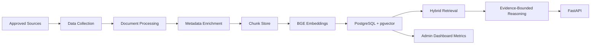

# BAHA Wellness Companion Knowledge Platform

## 1. Complete System Architecture

The platform is a governed RAG system. It separates ingestion, enrichment, retrieval, answer composition, and dashboard analytics so each layer can be audited independently.

Flow:



Component choices:

PostgreSQL is the primary knowledge store because BAHA needs relational metadata, version tracking, auditability, analytics, and search in one durable system. pgvector is selected for dense retrieval so the first production system does not operate two separate databases. PostgreSQL full-text search provides the lexical retrieval path and supports transparent query debugging. FastAPI is selected for typed, documented contracts and a clean path to dashboard and app integrations. `BAAI/bge-large-en-v1.5` is selected because it is a strong open retrieval model and can be deployed without sending sensitive usage data to a third-party embedding API.

## 2. Folder Structure

```text
src/baha_rag/
  api/                 FastAPI routes and endpoint contracts
  dashboard/           knowledge, source, freshness, and embedding analytics
  db/                  async database sessions and repository queries
  embeddings/          BGE embedding service and local hash backend
  generation/          evidence-bounded answer composition
  ingestion/           crawlers, processors, metadata enrichment, chunking
  retrieval/           dense, lexical, metadata, and fusion retrieval
  app.py               FastAPI app factory
  cli.py               ingestion command line entrypoint
  config.py            environment-driven settings
  safety.py            non-diagnostic and emergency guardrails
  schemas.py           API and metadata models
  taxonomy.py          adolescent wellbeing taxonomy
migrations/            PostgreSQL and pgvector schema
deploy/k8s/            Kubernetes deployment templates
docs/                  architecture and roadmap
tests/                 safety, retrieval, and ingestion unit tests
```

## 3. Database Schema

The schema is implemented in [001_init.sql](/Users/solomonkaruppiah/Desktop/Baha_Data/migrations/001_init.sql).

Core tables:

- `documents`: canonical source document with title, organization, URL, country, audience, publication date, content hash, ETag, version, and freshness metadata.
- `document_versions`: immutable version ledger for updates and rollback.
- `chunks`: evidence passages with required chunk metadata stored as JSONB and a generated full-text search vector.
- `embeddings`: 1024-dimensional pgvector embeddings, model name, and embedding version.
- `citations`: citation records connected to chunks and documents.
- `taxonomy`: governed BAHA condition taxonomy.
- `condition_profiles`: structured extraction output for each condition, held in draft until reviewed.
- `approved_sources`: source governance registry.
- `crawl_state`: incremental crawling, update detection, and retry state.
- `retrieval_events`: dashboard and retrieval-quality telemetry.

Indexes:

- HNSW vector cosine index on `embeddings.embedding`.
- GIN full-text index on `chunks.search_vector`.
- GIN JSONB index on `chunks.metadata`.
- freshness and organization indexes for dashboards.

## 4. API Design

Implemented endpoints:

- `POST /search`: hybrid search over dense, lexical, and metadata-filtered retrieval.
- `GET /conditions`: governed taxonomy.
- `POST /interventions`: evidence-backed supports for a condition.
- `POST /teacher-view`: teacher-specific answer structure.
- `POST /parent-view`: parent-specific answer structure.
- `POST /resources`: approved source citations and resources.
- `POST /chat`: cited response for a user query.
- `POST /conditions/profile`: structured condition extraction with all required fields.
- `POST /admin/ingest-url`: governed URL ingestion.
- `GET /admin/dashboard`: dashboard metrics.
- `GET /health`: readiness and liveness checks.

Response contract:

Every perspective answer includes `what_it_is`, `how_to_identify_it`, `what_to_do`, `when_to_seek_help`, `safety_note`, `evidence_sources`, and `confidence`.

## 5. ETL Pipeline

Collection:

- Validate organization and domain against approved source rules before fetching.
- Fetch with `ETag` and `Last-Modified` support for incremental crawling.
- Store crawl state for retries, freshness, and update detection.

Processing:

- HTML processing removes navigation, headers, footers, scripts, styles, and asides.
- PDF processing extracts page text through `pypdf`.
- Text is normalized and chunked with overlap to preserve context.
- References and tables are extracted where available.

Metadata enrichment:

- Infer taxonomy condition from controlled terms.
- Attach audience, country, evidence level, source, organization, language, age group, gender group, publication date, and severity.
- Store all required chunk metadata in JSONB.

## 6. Retrieval Pipeline

Hybrid retrieval:

1. Embed the query with BGE.
2. Run pgvector cosine search.
3. Run PostgreSQL full-text lexical search.
4. Apply JSONB metadata filters.
5. Fuse results with reciprocal-rank fusion.
6. Return chunks, citations, and normalized confidence.

Why hybrid:

Dense retrieval handles semantic matches such as "school refusal" and "school avoidance." Lexical retrieval protects exact terms such as "NCPCR", "self-harm", or "CBSE". Metadata filters keep parent, teacher, country, severity, and evidence-level views precise.

## 7. Deployment Architecture

Recommended production deployment:

- FastAPI service on Kubernetes with horizontal scaling.
- Managed PostgreSQL with pgvector enabled, daily backups, PITR, and restricted network access.
- Separate ingestion CronJobs or workers for approved-source crawling.
- Object storage for original PDFs and HTML snapshots when enabled.
- Secrets manager for database credentials.
- Observability through API latency, retrieval latency, result confidence, source freshness, ingestion failures, and chunk coverage.

Safety controls:

- Approved source validation before ingestion.
- Evidence-only answer composer.
- Mandatory citations.
- Non-diagnostic safety note.
- Emergency escalation language when emergency indicators appear.
- Retrieval telemetry for quality review.

## 8. Docker Setup

Local setup is implemented through [docker-compose.yml](/Users/solomonkaruppiah/Desktop/Baha_Data/docker-compose.yml). It starts:

- `pgvector/pgvector:pg16`
- The FastAPI application
- Automatic schema initialization from `migrations/`

Run:

```bash
cp .env.example .env
docker compose up --build
```

## 9. Kubernetes Setup

Kubernetes templates are in [deploy/k8s](/Users/solomonkaruppiah/Desktop/Baha_Data/deploy/k8s).

Included:

- Namespace
- ConfigMap
- Secret example
- API Deployment
- ClusterIP Service
- Ingestion CronJob template

Production additions:

- Ingress with TLS.
- Managed Postgres rather than in-cluster database for regulated workloads.
- NetworkPolicy restricting database access to API and ingestion jobs.
- PodDisruptionBudget for API availability.
- ExternalSecrets or cloud-native secret integration.

## 10. Implementation Roadmap

Phase 1: Foundation

- Finalize approved source registry with BAHA administrators.
- Deploy schema and API.
- Ingest a small manually reviewed seed corpus from WHO, NIMHANS, NCERT, CBSE, and MoHFW.
- Validate citations and metadata quality.

Phase 2: Retrieval Quality

- Add curated evaluation queries for adolescents, parents, teachers, and counselors.
- Measure recall, citation accuracy, and unsafe-answer refusal behavior.
- Tune chunk size, overlap, filters, and fusion weights.

Phase 3: Knowledge Extraction

- Add structured extraction jobs for definition, symptoms, risk factors, protective factors, parent signs, teacher signs, assessment methods, interventions, classroom support, family support, escalation indicators, emergency indicators, and approved resources.
- Require clinical knowledge review before publishing extracted condition profiles.

Phase 4: Product Dashboard

- Build administrator UI over `/admin/dashboard`.
- Add condition coverage, stale document queues, source distribution, ingestion errors, and retrieval-quality review.

Phase 5: Production Hardening

- Add authentication and role-based authorization.
- Add audit logs for ingestion and answer generation.
- Add object storage snapshots.
- Add worker queues for crawling and embedding.
- Add backup restore drills, monitoring, and incident runbooks.

## Clinical Boundary

The system is educational. It does not diagnose mental illness, predict suicide risk, replace clinical judgment, or provide clinical treatment. It retrieves and summarizes approved evidence, cites sources, and directs users to professional or emergency help when appropriate.
