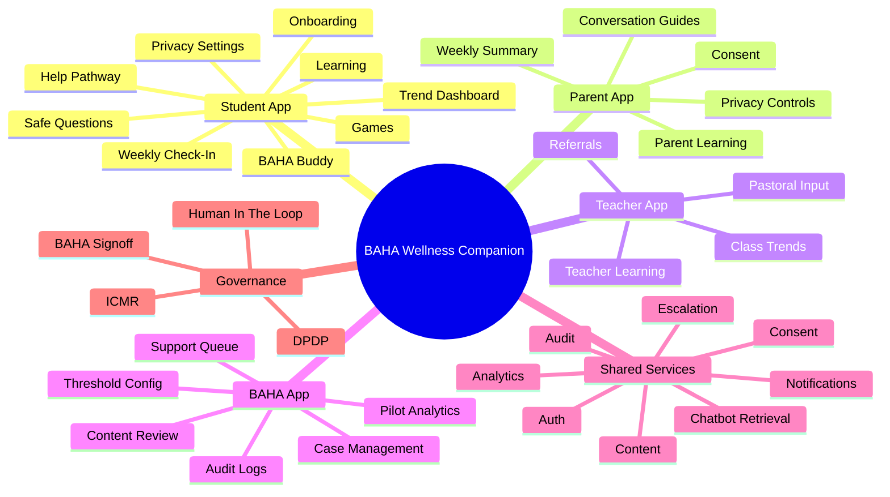

# Information Architecture

## IA Layers

1. Experience layer
   - Student App
   - Parent App
   - Teacher App
   - BAHA App
2. Domain-service layer
   - Identity
   - Consent
   - Check-ins
   - Trends
   - Content
   - Chatbot
   - Games
   - Notifications
   - Escalation
   - Analytics
   - Audit
3. Data layer
   - operational PostgreSQL
   - content asset storage
   - vector index
   - audit log store

## Master Navigation Tree

### Student App

- App Shell
  - Home
  - Check-In
  - Buddy
  - Learn
  - Games
  - Profile
    - badges
    - challenges
    - privacy settings
    - consent tiers
    - help and support

### Parent App

- App Shell
  - Home
  - Weekly Summary
  - Conversation Guides
  - Learn
  - Settings
    - consent status
    - privacy tiers
    - notifications
    - data rights

### Teacher App

- App Shell
  - Dashboard
  - Pastoral Input
  - Referrals
  - Learn
  - Settings

### BAHA App

- App Shell
  - Support Queue
  - Cases
  - Content
  - Thresholds
  - Analytics
  - Audit
  - Settings

## Permission Hierarchy

| Permission Area | Student | Parent | Teacher | BAHA |
|---|---|---|---|---|
| View raw check-in answers | yes, own only | no | no | yes, if clinically justified or case-open |
| View aggregate weekly trend | yes | yes, consent-gated | class level only | yes |
| Edit consent tiers | yes, subject to consent band | yes, in minor flow | no | override only via policy action |
| Use chatbot | yes | optional later | no | admin testing only |
| Submit pastoral flag | no | no | yes | yes |
| Open or manage case | no | no | limited referral view | yes |
| Publish learning content | no | no | no | yes |
| Configure thresholds | no | no | no | yes |

## Content Hierarchy

- Theme
  - sleep and physical activity
  - emotional wellbeing and mental health
  - digital and media use
  - substance awareness
  - life skills
  - nutrition
  - social wellbeing
- Audience
  - student early
  - student mid
  - student late
  - parent
  - teacher
- Format
  - card
  - story
  - video
  - audio
  - infographic
  - checklist
  - reflection
  - quiz

## Feature Dependency Graph

- onboarding depends on consent wording, age band model, and content tagging
- trend dashboard depends on weekly check-ins and analytics transformation
- parent summaries depend on consent tiers and aggregate trend generation
- teacher class trends depend on cohort anonymization logic
- chatbot depends on Safe Questions corpus, citations, escalation rules, and privacy disclosures
- games depend on age-banded content review and signal aggregation
- support queue depends on monitoring rules, acute safety protocol, and named human owners
- learning module depends on content CMS, tagging, and role routing

## Mermaid Mindmap

