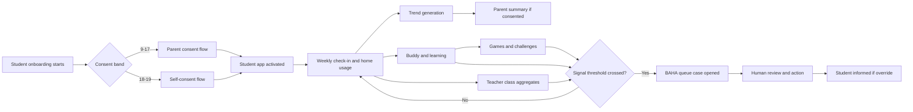

# Master User Journey

## Cross-Role Journey Phases

1. Institutional readiness
   - BAHA assigns reviewers and safeguarding owners
   - school onboarding and permission are completed
   - content and thresholds are approved
2. Identity and consent
   - student enters age-band journey
   - legal consent band is resolved
   - parent consent or self-consent completes
3. Habit formation
   - weekly check-ins begin
   - trends start after enough data accrues
   - learning and games establish supportive repeat use
4. Insight and support
   - student uses BAHA Buddy and Safe Questions
   - parents receive aggregate summaries where allowed
   - teachers contribute pastoral context
5. Monitoring and intervention
   - rules surface signals into BAHA queue
   - human review decides action
   - student is informed during overrides
6. Continuous governance
   - thresholds recalibrated
   - content re-reviewed
   - pilot analytics exported

## Student Journeys by Age Band

### Early Adolescence (9-13)

- stronger guidance during onboarding
- higher comprehension focus in privacy explanation
- softer guardrails around time limits and reminders
- more structured reflection options than open text

### Mid Adolescence (14-16)

- greater emphasis on self-expression and emotional vocabulary
- deeper narrative games and peer-pressure scenarios
- stronger support-hand-off framing within chatbot

### Late Adolescence (17-19)

- more direct autonomy and privacy control messaging
- denser insight view
- more self-serve support requests and self-consent mechanics

## Parent Journey

- consent request received
- consent status confirmed
- privacy tiers negotiated
- weekly summaries reviewed
- conversation guide used
- alert state only when safeguarding rules require

## Teacher Journey

- completes training and onboarding
- views weekly class trends
- enters pastoral signal
- submits referral
- tracks referral and safeguarding status

## BAHA Journey

- configures content and thresholds
- monitors queue
- opens case
- performs review and action logging
- publishes analytics and maintains governance

## Shared Journey Risks

- expired consent blocks data processing
- low connectivity affects check-in sync and content fetch
- insufficient cohort size hides teacher analytics
- missing human owner blocks threshold activation
- expired content review date suppresses content publication

## Master Swimlane

